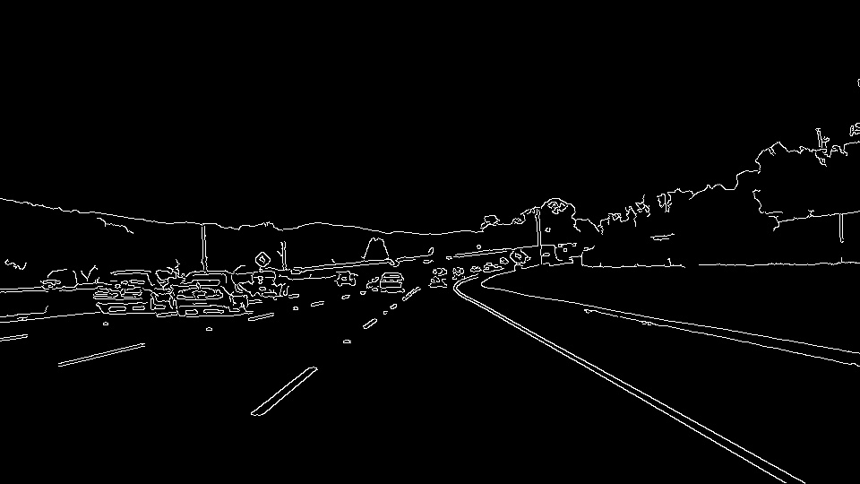
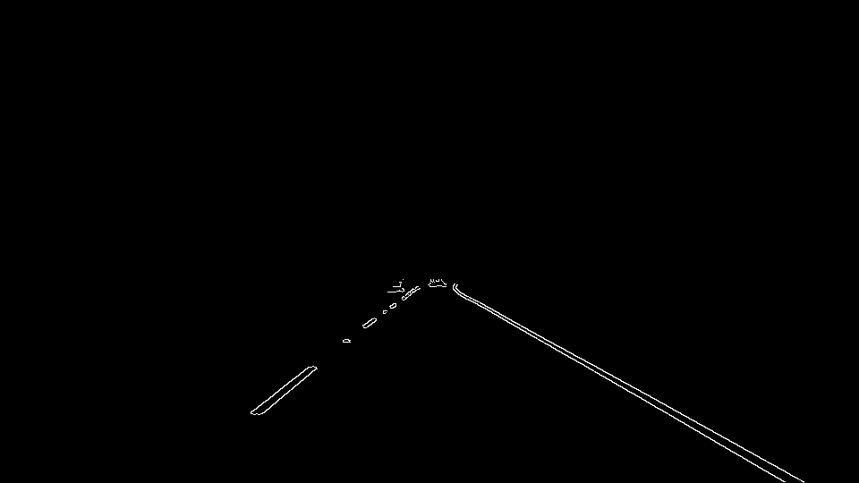
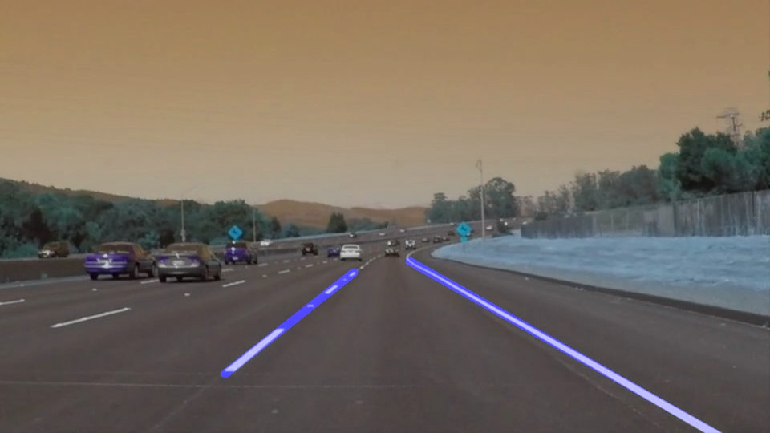

#**Finding Lane Lines on the Road** 

This is a write-up and jupyter results repo for the LaneLines project which 
involves detection of lane lines on a road.

### Reflection

My pipeline consisted of 5 steps.

1. Convert the images to greyscale
2. Use Gaussian blur on the greyscale image
3. Use the canny algorithm to detect edges in the image;
 applying low threshold of 50 and high threshold of 150 to
 reject unwanted pixels

3. Select a region of interest on the image that only contains
 the lane of interest and ignores other features on the road such
  as cars and trees

4. Perform hough transformation on the regions of interest of the
 'canny' image to extract lane lines from the canny edges; this was
  achieved by defining the hough space limits, providing
  minimum/maximum number of pixels that would qualify to form a
  line and determining the threshold number of votes for line
  formation on the hough space
5. Finally drawing the hough lines on the image

In order to draw a single line on the left and right lanes,
 I modified the draw_lines() function by looping through all the lines
 and selecting the lines of interest as follows: any line with a 
 positive gradient belonged to the right lane and the negative gradient 
 lines belonged to the left; I collected all points of the left and 
 right lanes in lists.
 Finally, after collecting the lines, I used the numpy library's 
 polyfit function to determine an average line for each of the lanes. 
 From this average line, I drew the lane lines over the image using 
 the start point of the line to the end point of the line.
 For the left lane, the start point was smallest value of X and 
 largest value of X while for the right lane, the start point was the 
 largest value of X and largest value of Y because of their respective 
 gradients. 

###Shortcommings of this pipeline

One potential shortcoming would be what would happen
 when we had a curved road. This is for the following reasons:
 
1. The current algorithm uses gradients to differentiate lanes and determine
placement of the lines on the road. The gradients for the lanes would swap signs
if a steep curve on the road was encountered.
2. The current algorithm for drawing lines on the road extrapolates
 a linear average straight line which would throw the resultant line all
 over the place when a vehicle is moving through a curve.
 

Another shortcoming could be: if the distance between the self driving
vehicle and the vehicle ahead was small, I suspect the hough transform
algorithm might not be accurate as the region of interest will also
include an unwanted object, the vehicle ahead.

###3. Suggest possible improvements to your pipeline

A possible improvement would be to use an algorithm that draws curved lines
instead of a straight line algorithm.